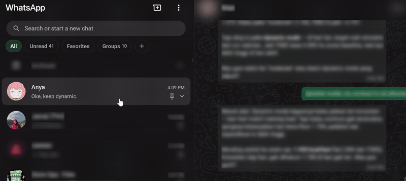

  

# WA Privacy Blur

Browser extension that blurs WhatsApp Web content for privacy — hover to reveal. Protects your chats from shoulder-surfing in cafes, offices, and shared spaces.

  
  
  
  =140">
  

## Features

Automatically blurs sensitive content on WhatsApp Web:

| Area | What gets blurred |
|---|---|
| **Chat list** | Contact/group names, last message previews, avatars, unread badges |
| **Header** | Contact/group name, profile picture |
| **Messages** | Text content, photos, stickers, videos |
| **Group chats** | Sender names in each bubble |
| **Profile drawer** | Name, about, phone number |

Everything stays blurred until you hover — then smoothly reveals. Move away and it blurs again.

**Options page** (v1.2+): toggle individual blur categories — sidebar name, preview, avatar; header name, avatar; message text, media, sender names; group/profile info.

## Install

### Firefox

 — pending review

Manual install from [Releases](https://github.com/jamelwa/wa-privacy-blur/releases):
1. Download the `.xpi` or `.zip`
2. Go to `about:addons` → gear icon → "Install Add-on From File"
3. Select the file

### Chrome / Edge / Brave

 — pending review

Manual install (Developer mode):
1. Clone this repo
2. `chrome://extensions` → "Load unpacked"
3. Select the extension folder

## How It Works

- Pure JS blur via `mouseenter`/`mouseleave` — CSS `filter + :hover` breaks due to stacking contexts
- `MutationObserver` catches new elements as WhatsApp renders them
- Per-bubble and per-row hover scopes — hovering one chat doesn't reveal others
- Scoped DOM searches (no broad `querySelectorAll('*')`)
- Options stored in `chrome.storage.sync`, hot-reloads without page refresh

## Privacy

This extension does **not** collect, transmit, or store any personal data. All logic runs locally in your browser. No analytics, no tracking, no accounts.

## License

MIT — see [LICENSE](LICENSE)
